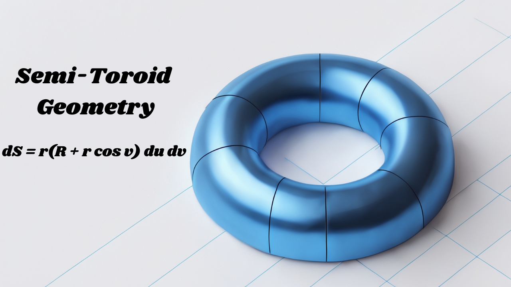

# Semi-Toroid Geometry — Analytical & Numerical Validation




**Mathematical derivations, reproducible code and numerical validation for a semi-toroidal (semi-torus) surface.**

This repository contains:

- Rigorous derivations of the first and second fundamental forms for the semi-torus.
- Explicit expressions for unit normal, principal curvatures, Gaussian & mean curvature.
- Analytical formulas for surface area and volume of the semi-torus.
- Reproducible numerical validation (composite midpoint) with convergence tables and CSV output.
- A small GitHub Pages site (in `docs/`) that presents the theory and results.

## Contents

- `src/chapter3.tex` — The full LaTeX source for Chapter 3 (geometry + numerical validation).
- `src/semi_torus_validation.py` — Python script: runs midpoint integration, prints & writes results to `data/`.
- `docs/index.html` — GitHub Pages landing page (MathJax-enabled).
- `data/semi_torus_convergence.csv` — CSV output of numerical convergence (generated by script).
- `.github/workflows/validate.yml` — GitHub Action to run the Python validation and upload results.

[View the PDF](toroidal.pdf)


## Quick start

Requirements: Python 3.8+, `numpy`, `pandas`.

```bash
# create virtualenv (optional)
python -m venv .venv
source .venv/bin/activate

pip install -r requirements.txt   # or pip install numpy pandas

# run validation
python src/semi_torus_validation.py
# CSV will be written to data/semi_torus_convergence.csv
